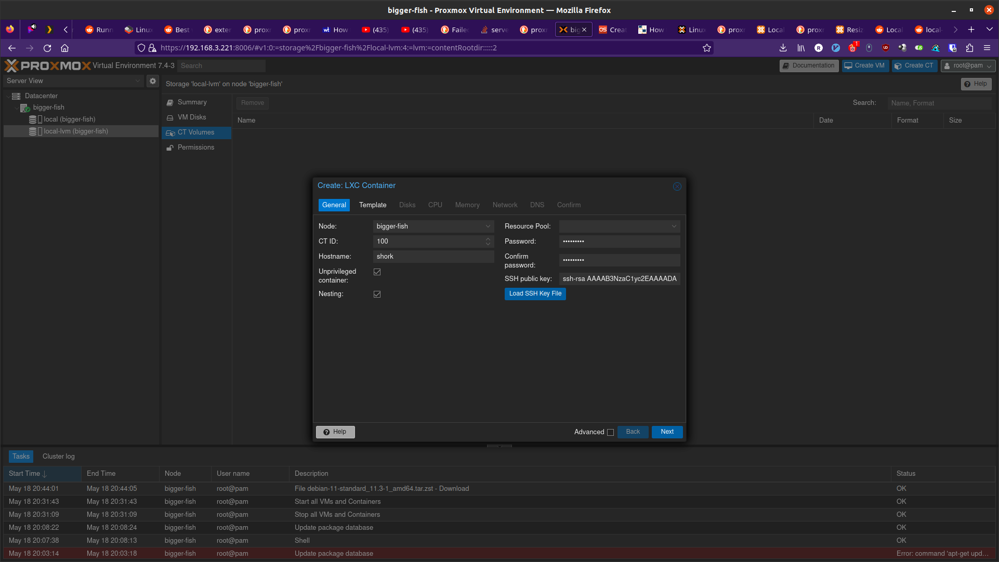
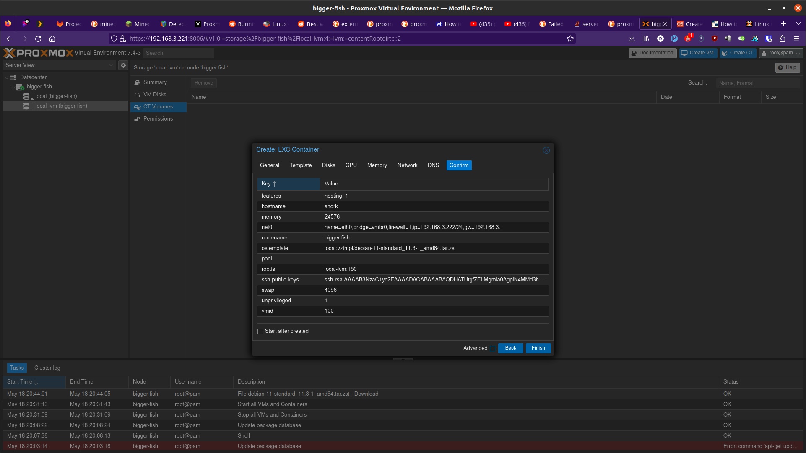

Building a Server To Run Linux (May 2023)
==========================================

May 16, 2023

I'm writing this to document my journey through this learning experience.
If I could do it again, there are many things I would do differently.
I had help picking out the hardware, but I did not do my research for Plex transcode support (as talked about below).

This is sort of a blog post, but it's also a place for me to take notes. I expect my future "blog" posts will be more structured than this mess.

On May 13 I bought parts for a new computer to be used as a server.

* Motherboard: Gigabyte B450M DS3H WiFi
* CPU: AMD Ryzen 5 5600X
  
  * 6 Core, 12 Thread Processor, PCIe 4.0
  * 4.6 GHz Max Boost, 3.7 GHz Base

* GPU: Intel Arc A380
* CPU Cooling: Thermaltake UX200 SE
* Power supply: Thermaltake Toughpower GX2 600W
* Case: Thermaltake Versa H17

Use #1 (Plex Hardware Transcoding)
---------------------------------------

It's a nice build for a budget PC and as a gaming rig I have no doubt it would be sweet, but this isn't going to be used for gaming.
I primarily bought this because I wanted to have a more powerful server to do Plex transcoding.
I figured that any sort of GPU would allow Plex to happily do hardware transcoding.
The problem is that Plex does not actually support all hardware setups.
Specifically it has these requirements (also found at https://support.plex.tv/articles/115002178853-using-hardware-accelerated-streaming/)

* A Plex Pass - I have a lifetime pass
* Updated Version of Plex - I update Plex once or twice a month
* An Intel CPU that supports Intel Quick Sync Video

.. note::

  (EDIT (May 23) after writing this section): I now see that the "Linux-specific Notes" section of the requirements says that NVIDIA GPUs are also supported
  if Intel Quick Sync Video is not available (such as when you don't have an Intel CPU).
  Also, I wish I had seen this forum thread sooner: https://forums.plex.tv/t/anybody-get-hw-transcoding-working-with-the-a380-on-ubunutu/823618

That's right, in order to get Plex to use your GPU to do hardware transcoding, you **need an Intel CPU**.
OK, so that's my bad. I should have done more research.
But seriously Plex? What the fuck. Support more stuff please.
I'm sure Plex has techincal reasons for what they support, but it's seriously annoying as an Intel CPU for the same price would have been worse.

Getting an Intel Arc A380 GPU Working
---------------------------------------

Before I even realized that Plex hardware transcoding would not work, I was trying to get driver support for my Intel Arc GPU.
My last server I installed Debian on, so I figured I would also install Debian on this server.

I came across these links: https://www.intel.com/content/www/us/en/products/sku/227959/intel-arc-a380-graphics/downloads.html and https://dgpu-docs.intel.com/installation-guides/ubuntu/ubuntu-jammy-arc.html.
Those instructions are specifically for Ubuntu 22.04 but I still tried doing those instructions for Debian 11.
It turns out it needed a more up to date kernel so I followed some tutorial to help me use the testing branch for the kernel but everything else
remained on the bullseye branch. It was kind of hacky and I did eventually get an up to date kernel, but as soon as I tried installing the headers
for that kernel, I got broken dependencies.
I decided I did not want to deal with installing drivers for this on Debian, so I installed Ubuntu Server 22.04.

.. note:: 

  I believe that drivers for Intel GPUs are in more recent Linux kernel versions.
  So this might be outdated and unecessary in the future.

Installing the drivers on Ubuntu Server 22.04 went very smoothly.
At this point I still thought I could get Plex to transcode and I messed around for a while.
I then fixated on trying to get Resizeable BAR working because people had been talking about the performance enhancements from that.

* https://arstechnica.com/civis/threads/plex-with-intel-arc-380.1489045/

  * Forum thread about using Intel Arc GPUs with Plex
  * Also talks about GPU passthrough and Proxmox

* https://www.reddit.com/r/PleX/comments/y1tz8j/plex_with_intel_arc_gpu/

  * Discussion of using an Intel Arc GPU for transcoding on Plex

* https://www.reddit.com/r/PleX/comments/yb4cg3/my_experience_with_intel_arc_a380_plex/
  
  * "Resizeable BAR is not required"

I did not immediately see that Resizeable BAR is not required and started trying to change stuff in my BIOS to magically have it enable.
According to the guide for installing drivers on Ubuntu 22.04, the output of ``lspci -v |grep -A8 VGA`` should say that ``Memory ... [size=<YOUR SIZE>G]``.
Where ``<YOUR SIZE>`` is the VRAM of the GPU. In my case that should say ``6G`` if Resizeable BAR is enabled, but it continues to say ``size=[256M]``.
My full output is this:

.. code-block::

  0c:00.0 VGA compatible controller: Intel Corporation Device 56a5 (rev 05) (prog-if 00 [VGA controller])
          Subsystem: ASRock Incorporation Device 6004
          Flags: bus master, fast devsel, latency 0, IRQ 73, IOMMU group 19
          Memory at fb000000 (64-bit, non-prefetchable) [size=16M]
          Memory at d0000000 (64-bit, prefetchable) [size=256M]
          Expansion ROM at 000c0000 [disabled] [size=128K]
          Capabilities: [40] Vendor Specific Information: Len=0c <?>
          Capabilities: [70] Express Endpoint, MSI 00
          Capabilities: [ac] MSI: Enable+ Count=1/1 Maskable+ 64bit+

So to try and get that to change, I tried changing things in my BIOS.
I tried disabled CSM (Compatibility Support Module) in hopes of forcing a UEFI boot.
When I did that it would not boot into my OS until I re-enabled it.
I also had to have Secure Boot disabled in order for it to boot.
Even with CSM enabled I tried running ``test -d /sys/firmware/efi && echo efi || echo bios`` to see if I was using UEFI boot.
No matter what I tried, ``bios`` would always be printed.
Maybe it's still possible to get Resizeable BAR support, but it's not a top priority at the moment.
All while doing this, I was also testing running ``glxgears`` and ``glmark2`` and I was getting not great performance.
Keep in mind that I had an SSH connection to a headless server and I have X11 forwarding enabled.
This does not allow for the GPU to be used. I'm not exactly sure what is going on behind the scenes with X11 forwarding,
but it sure was not using my GPU. I only learned that later.

.. note::

  I do believe it is possible to have hardware accelerated X11 sessions, but by default it is not the case.
  I have heard mentions in forums of somehow using xpra, but at the time of writing this I don't really know anything about xpra.

Finding a Use For My GPU
-----------------------------

Now that I have my GPU ready to be used by *something*, I want to find a use for it rather than seeing if I can return it.
I set up QEMU on my server and accessed it remotely via ``virt-manager``.
I got a Windows VM spun up in hopes of installing Steam and using it to stream games from.
Not only did Internet Access not work out of the box, I realized that the VM isn't going to magically use my GPU.

I opted to try installing steam on the bare metal Linux install.
I opened Steam over X11 hoping that when I chose to stream the game the rendering would magically happen on some hidden display,
but instead when I chose to stream the game on my laptop with steam open, the X11 forwarded steam tried launching the game and render it over X11.
My screen glitched super hard until the remote game eventually crashed likely because of all the glitchyness of the X11 window trying to be fullscreen
along with my client window trying to be fullscreen.
I realized that I would need to follow some tutorial to get a desktop session running on my server that I could remote desktop into.
From the little Duckduckgoing I did, I found that I would have to do some weird xorg configuration and depending on how I go about it, a dummy HDMI plug would be required.
For AMD GPUs it seems that they have the ability to support virtual displays.
However for Intel's i915 driver, I could not find anything about virtual displays.

Use #2: A Windows VM With GPU Capabilities
---------------------------------------------

https://christitus.com/vm-setup-in-linux/

Now that I know a little more about what I'm doing, I'm going to give QEMU another shot.
When doing this configuration, I will set up GPU passthrough by enabling PCIe Passthrough.
GPU passthrough will require IOMMU support on my Motherboard and CPU.
I will have to enable IOMMU in the BIOS of my Motherboard.
It looks like `AMD Ryzen 5 5600x is supported <https://en.wikipedia.org/wiki/List_of_IOMMU-supporting_hardware#AMD_based>`_.
I was unable to find a link confirming my Gigabyte motherboard is supported, but it seems to be supported.
In BIOS I go Peripherals > AMD CBS > NBIO Common Options > IOMMU > Enabled.
By default it was set to auto. When I enabled it some of the settings updated.
I'm not sure if Auto was sufficient, but better safe than troubleshooting.
It's worth noting that `this reply <https://forum.level1techs.com/t/ryzen-3rd-gen-b450-pcie-passthrough/144933/2>`_ states that
my particular motherboard will not work, but I'll try it anyway.

I will have to edit ``/etc/default/grub`` and set ``GRUB_CMDLINE_LINUX_DEFAULT="quiet amd_iommu=on"`` then run ``update-grub``.

For QEMU I need the VirtIO drivers: https://launchpad.net/kvm-guest-drivers-windows/+download.
Source at: https://github.com/virtio-win/kvm-guest-drivers-windows,
which can be downloaded here: https://github.com/virtio-win/virtio-win-pkg-scripts/blob/master/README.md

Use #3: Using Proxmox to create VMs
----------------------------------------

So I could use QEMU to create VMs on my Ubuntu install, or I could instead install Proxmox which is designed to manage VMs.
Proxmox is a type 1 hypervisor, while QEMU is a type 2 hypervisor.

The most important part of a Proxmox install is going to be getting my Docker containers running.
My naive thought would be to install Docker on the host machine without containerizing or virtualizing the running Docker containers.
I mean, I've always installed Docker on bare metal and let Docker handle containerization.
But this time I could run my Docker containers inside a VM or using LXC (Linux Containers).
LXC has two modes: privelidged and unpriveledged.
Everyone seems to come to the conclusion that there is no circumstance where you should use privelidged LXC unless you really need to.
So my two options are unpriveledged LXC or install something like a Debian VM.
If I use LXC then I get to deal with user mappings and I have to understand how my external hard drive needs to mount (maybe on the host machine?).
The files on my hard drive are owned by a user:group I have commonly named media:media.
The `documentation on "Bind Mount Points" <https://pve.proxmox.com/wiki/Linux_Container#_bind_mount_points>`_ 
seems to suggest that I can mount the hard drive on the host machine and then access it in my LXC container.
As I thought, "With unprivileged containers you might run into permission problems caused by the user mapping".
By default, ownership inside inside the guest is mapped to this: (from `this tutorial for binding unprivileged <https://itsembedded.com/sysadmin/proxmox_bind_unprivileged_lxc/>`_)

.. code-block::

  Host UID/GID = Guest UID/GID + 100000 

That means that if I wanted the LXC container to have access to files on my hard drive, I need to change ownership to 100127:100133 on my host machine.
(127:133 is the uid:gid of media:media).
This is possible and `is documented <https://pve.proxmox.com/wiki/Unprivileged_LXC_containers>`_.
This seems very doable, but first I need to back stuff up and install Proxmox!

Installing Proxmox
^^^^^^^^^^^^^^^^^^^^^^

I now `get framebuffer errors <https://forum.proxmox.com/threads/how-to-install-proxmox-on-a-system-that-only-has-an-intel-ark-gpu.126302/>`_
(``proxmox install cannot run in framebuffer mode. Please specify busIDs``)
when installing because of course Proxmox installation will error out because it's trying to use my graphics card but does not have drivers for it.
The solution is to either have an iGPU, use another GPU, or just install Debian and then put PVE on top of it.
Here's `another good post <https://forum.proxmox.com/threads/7-3-install-failed-with-error-cannot-run-in-framebuffer-mode.123728/>`_ describing the error I got.

Lucky for me `there is a workaround <https://forum.proxmox.com/threads/generic-solution-when-install-gets-framebuffer-mode-fails.111577/>`_.

.. code-block:: console

  root@proxmox:/# lspci | grep -i vga
  0c:00.0 VGA compatible controller: Intel Corporation Device 56a5 (rev 05)

I start editing ``/usr/share/X11/xorg.conf.d/10-amdgpu.conf`` 
as a starting template and I eventually end up with this that I save to ``/usr/share/X11/xorg.conf.d/10-generic-graphics.conf`` :

.. code-block:: 

  Section "Device"
    Identifier "Card0"
    Driver "fbdev"
    BusID "PCI:0xc:0:0"
  EndSection

I have the BusID set to that because xorg requires a format of `PCI:bus:device:function <https://www.x.org/releases/X11R7.7/doc/man/man5/xorg.conf.5.xhtml#heading10>`_.
Values must also have explicit ``0x`` prefix for hexadecimal values and just ``0`` for octal values.
I tried running ``xinit`` and it did not work. It made 1/4 of my screen a terminal with a white background.
It didn't even have any focus.
So I tried adding this

.. code-block::

  Section "Screen"
    Identifier "Screen0"
    Device "Card0"
    Monitor "Monitor0"
    DefaultDepth 24
    SubSection "Display"
      Depth 24
      Modes "1920x1080"
    EndSubSection
  EndSection

Still no luck. Alright maybe if I follow `this youtube video <https://www.youtube.com/watch?v=-6fRTpmmuHs>`_.
It recommends I start the installation using debug mode. I try that and then try to confirm the ``lspci | grep -i vga`` command.
Weirdly enough, that command gives no output. It seems the ``lspci`` command is different now?. 
I'll just do the same thing I've been doing. I do have to create the xorg directory this time.

.. code-block::

  mkdir -p /usr/share/X11/xorg.conf.d/

Now I edit the ``10-fbdev.conf`` file in that directory and put this in it:

.. code-block:: 

  Section "Device"
    Identifier "Card0"
    Driver "fbdev"
    BusID "PCI:12:0:0"
  EndSection

I press CTRL+D and am booted to another terminal session. I ``ls`` the config directory and notice the file I had just created is gone.
So, in order to cover all my bases, I create the file again and put the same stuff as above in it.
It works!!!! Fucking finally.
What specific thing made it work? The different filename? Editing the file the first time in debug mode? The second file I created?
Who knows. I don't care enough at this point to try to go through that again.
I go through the install process and set my FQDN to ``bigger-fish.local`` as I am planning on naming my LXC ``shork``, just like my old installation's hostname was.

I was prepared to install this on top of Debian 11.7, but now there's no need!
Plus, it looks like Proxmox correctly setup a UEFI boot, something that was not setup to satisfy my computer with Ubuntu Server 22.04.
I now login at ``https://IP:8006`` and use root/mypassword.

Configuring Proxmox
^^^^^^^^^^^^^^^^^^^^

Now that Proxmox is setup and we have access to the web interface... I'm going to use the command line! These commands were useful.

.. code-block:: shell

  mv /etc/apt/sources.list.d/pve-enterprise.list /etc/apt/sources.list.d/pve-enterprise.list.disabled
  # NOTE: change bullseye if you are using this as a reference for a future version of proxmox
  echo "deb http://download.proxmox.com/debian/pve bullseye pve-no-subscription" >> /etc/apt/sources.list.d/pve-no-subscription.list
  apt-get update
  apt-get dist-upgrade

I also found the second half of `Proxmox VE Install and Setup Tutorial <https://www.youtube.com/watch?v=7OVaWaqO2aU>`_ useful for being shown around the Proxmox web UI.

Techno Tim's "Before I do anything on Proxmox, I do this first...
^^^^^^^^^^^^^^^^^^^^^^^^^^^^^^^^^^^^^^^^^^^^^^^^^^^^^^^^^^^^^^^^^^^^^

I'm gonna start this video `Before I do anything on Proxmox, I do this first <https://www.youtube.com/watch?v=GoZaMgEgrHw&list=PL8cwSAAaP9W37Vnxkw6__sshVY-XohWNm&index=1&t=190s>`_.
It first talks about configuring ZFS storage. I don't seem to have a way to configure storage because I told proxmox to 

Now we want to configure storage, which is shown .
That shows how to create ZFS storage, but that's not quite what I want at the moment since I only have a single internal drive (my OS drive).
I made the mistake of allocating pretty much the entirety of it.

I can now `enable IOMMU <https://www.youtube.com/watch?v=GoZaMgEgrHw&list=PL8cwSAAaP9W37Vnxkw6__sshVY-XohWNm&index=1&t=378s>`_.
I had turned on IOMMU in my BIOS earlier. Now I edit ``/etc/default/grub``:

.. code-block::

  # ...
  # Added amd_iommu=on by Lavender on 2023-05-18
  #GRUB_CMDLINE_LINUX_DEFAULT="quiet"
  GRUB_CMDLINE_LINUX_DEFAULT="quiet amd_iommu=on"
  # ...

Now I save, run ``update-grub``. Now I can edit ``/etc/modules`` and add these lines:

.. code-block::

  vfio
  vfio_iommu_type1
  vfio_pci
  vfio_virqfd

Now I can reboot. I don't need Proxmox to be VLAN aware yet, but I might use TrueNAS to create NFS storage in the future like he does.
For my Windows VM I'll get to eventually, I will have to have the VirtIO ISO available, which is shown on `Before I do anything on Proxmox, I do this first... <https://www.youtube.com/watch?v=GoZaMgEgrHw&list=PL8cwSAAaP9W37Vnxkw6__sshVY-XohWNm&index=1&t=673s>`_.

Create a Linux Container
^^^^^^^^^^^^^^^^^^^^^^^^^^^^

Alright, got a little off track, but the stuff I did above will help me later.
I go to Datacenter > bigger-fish > local (biffer-fish) > CT Templates.
Now I click on Templates and download ``debian-11-standard``.
I now create a CT (upper right corner).

In the next step, I use the downloaded template as the template.
For disks I get to allocate a certain amount from local-lvm. I'm choosing 150GB becaue this will be my main container.
For Memory I'm going to choose 24GB (24576 MiB) out of my 32GB. For Swap I choose 4096 MiB out of my 8GB.
For the network, I'm setting my IPv4 address to be Host IP + 0.0.0.1, so it remains on the same /24 subnet.
DNS will use host settings.

Confirm and then remember to start your container!
Make sure to also set Options > Start at boot. (or run ``pct set 100 -onboot 1`` assuming 100 is the ID).
Now you can SSH into your container!
Now that I have SSH access, I'm going to copy stuff over with rsync and install Docker.
Installing Docker here is just like installing Docker on any machine (https://docs.docker.com/engine/install/debian/#install-using-the-repository).
Before you get too far, make sure to create a non-root user for normal use.

.. code-block::

  apt install sudo
  useradd --create-home --user-group --shell /usr/bin/bash --groups sudo lavender
  passwd lavender

Now you can log in as your user.

Mounting an External Hard Drive
^^^^^^^^^^^^^^^^^^^^^^^^^^^^^^^^^^^^

The first step of mounting an external hard drive for use in an LXC is the same as any other system.
On the host system edit ``/etc/fstab`` to add an entry for the hard drive.
Once you do that then you can do the Proxmox specific configuration.
With the ``UUID=94a57cad-a759-4147-855b-fbac0b443df9 /srv/lavender_drive1 ext4 defaults,nofail 1 1`` line added, 
I decided to run ``chown -R 100127:100133 /srv/lavender_drive1/ && chown 0:0 /srv/lavender_drive1/`` to make this easy on myself.
The permissions are easy to change on the drive itself and I don't see a reason for making my setup more complex.

Now we want to create a `bind mount point <https://pve.proxmox.com/wiki/Linux_Container#_bind_mount_points>`_.
Run this command:

.. code-block::

  pct set 100 -mp0 /srv/lavender_drive1,mp=/srv/lavender_drive1
  # or add `mp0: /srv/lavender_drive1,mp=/srv/lavender_drive1` to /etc/pve/lxc/100.conf

Creating a Windows 10 VM
^^^^^^^^^^^^^^^^^^^^^^^^^^

It's finally time to create a Windows VM with everything else setup.
I'm going to be using `Virtualize Windows 10 with Proxmox VE <https://www.youtube.com/watch?v=6c-6xBkD2J4>`_ to help myself out.

Download a Windows 10 ISO on `Microsoft's Windows 10 Download page <https://www.microsoft.com/en-us/software-download/windows10ISO>`_.
Now go to Proxmox. Navigate to DAtacenter > bigger-fish > local (bigger-fish) > ISO Images.
Then click upload. Alternatively, you can copy your download link and then do "Download from URL" instead (this might be faster than downloading to your computer then uploading).
Now go to `virtio iso download <https://github.com/virtio-win/virtio-win-pkg-scripts/blob/master/README.md>`_ to download the "Stable virtio-win ISO".
Upload it (or do download from URL).

Now, create a VM and select the Windows 10 ISO. Set the settings as you would expect.
Enable System > Qemu Agent.
In Disks set Bus/Device to SCSI. Set the storage as you would like. I'm going to give this 110GB.
Set Cache to "Write back".
Max out your CPU Cores.
For Memory, set the maximum ("Memory (MiB)") to whatever. I'm doing 12GB (12288 MiB).
Keep the Minimum memory around 2GB or whatever you would like.
In Network, set Model to "VirtIO (paravirtualized)".
Confirm the settings.
In Hardware of the new VM, add a CD/DVD drive and give it the virtio driver ISO and use a Bus/Device of IDE/1.
Now start the machine and go to the Console window to get access to the installation.
Do a custom installation. Load the virtio driver when it gives you the option.
Browse for the drivers individually. Start with vioscsi, then load NetKVM, Balloon. Now click next.
Continue through the windows installation.
Temporarily disconnect your network hardware to create an offline account if needed.
Once finished, open device manager and search for drivers for any "Other devices".
Then go into files and browse in the guest agent folder and run qemu-ga-x86_64.exe.
Reboot the machine and confirm that IP information is shown. This confirms that the guest agent is running.
Enable Remote Desktop if you would like (may not work on Windows 10 Home, though).
I recommend shutting this VM down and converting it to a template. Now you can clone it.

Passing the GPU through
^^^^^^^^^^^^^^^^^^^^^^^^

I'm following `TechnoTim GPU Passthrough <https://techno-tim.github.io/posts/gpu-passthrough/>`_.
I didn't do all of the recommended changes to ``/etc/default/grub``. Instead I just left the settings I changed above as they were.
I had already done most of the necessary configuration.
Before changing more settings, we need to `install tightvnc <https://www.tightvnc.com/download.html>`_.
Configure it then connect with a VNC viewer and confirm it works on reboot (also make sure to assign a static IP).
Now you can:

* Change BIOS to "OVMF (UEFI)"
* Machine type to "q35"
* Add an EFI Disk - I use local-lvm for storage

Now edit ``/etc/pve/qemu-server/102.conf`` (or your corresonding VM's config file).
Add this line:

.. code-block::

  cpu: host,hidden=1,flags=+pcid

Now add a PCI device. I know which device it is from my ``lspci | grep -i vga`` from earlier.
Check all of the options: "All Functions, Primary GPU, ROM-Bar, PCI-Express".
I'm not worried about blocking the i915 driver from being loaded since it shouldn't be installed on the host OS in my current kernel version.

I get this:

.. code-block::

  kvm: warning: host doesn't support requested feature: CPUID.01H:ECX.pcid [bit 17]
  kvm: warning: host doesn't support requested feature: CPUID.01H:ECX.pcid [bit 17]
  kvm: warning: host doesn't support requested feature: CPUID.01H:ECX.pcid [bit 17]
  kvm: warning: host doesn't support requested feature: CPUID.01H:ECX.pcid [bit 17]
  kvm: warning: host doesn't support requested feature: CPUID.01H:ECX.pcid [bit 17]
  kvm: warning: host doesn't support requested feature: CPUID.01H:ECX.pcid [bit 17]
  kvm: warning: host doesn't support requested feature: CPUID.01H:ECX.pcid [bit 17]
  kvm: warning: host doesn't support requested feature: CPUID.01H:ECX.pcid [bit 17]
  kvm: warning: host doesn't support requested feature: CPUID.01H:ECX.pcid [bit 17]
  kvm: warning: host doesn't support requested feature: CPUID.01H:ECX.pcid [bit 17]
  kvm: warning: host doesn't support requested feature: CPUID.01H:ECX.pcid [bit 17]
  kvm: warning: host doesn't support requested feature: CPUID.01H:ECX.pcid [bit 17]
  kvm: -device vfio-pci,host=0000:0c:00.0,id=hostpci0,bus=ich9-pcie-port-1,addr=0x0: Failed to mmap 0000:0c:00.0 BAR 2. Performance may be slow
  kvm: -device ide-cd,bus=ide.0,unit=1,drive=drive-ide1,id=ide1,bootindex=103: Can't create IDE unit 1, bus supports only 1 units
  TASK ERROR: start failed: QEMU exited with code 1

For the "Fail to mmap" error, I need to add ``initcall_blacklist=sysfb_init`` as a kernel parameter.
Edit ``/etc/default/grub``:

.. code-block::

  # (comments shown as a reference to what my file looks like)

  # Added amd_iommu=on by Lavender on 2023-05-18
  #GRUB_CMDLINE_LINUX_DEFAULT="quiet"
  # Altered 2023-05-19 by Lavender
  #GRUB_CMDLINE_LINUX_DEFAULT="quiet amd_iommu=on"
  GRUB_CMDLINE_LINUX_DEFAULT="quiet amd_iommu=on initcall_blacklist=sysfb_init"

Now run ``update-grub`` and reboot. For some reason I get `this warning <https://askubuntu.com/questions/1414245/why-do-i-get-warning-os-prober-will-not-be-executed-to-detect-other-bootable-p>`_.
Whatever. I'll ignore the warning.
My Windows VM tries to start on boot and fails. ``kvm: -device ide-cd,bus=ide.0,unit=1,drive=drive-ide1,id=ide1,bootindex=103: Can't create IDE unit 1, bus supports only 1 units`` is still present.

"Can't create IDE unit 1, bus supports only 1 units". No problem. I remove my virtio CD/DVD Drive which is currently labeled ide1.
Starting the VM gives success! Wait for the Guest Agent to tell me the IP... It doesn't tell me...
Shutting down does not work. A Shutdown task doesn't seem to timeout, so subsequent commands to do something like reset it give: 
``TASK ERROR: can't lock file '/var/lock/qemu-server/lock-102.conf' - got timeout``.
I remove the lock with ``rm /run/lock/qemu-server/lock-102.conf && qm unlock 102``.
Now my reset and stop commands work.
To try to get this back in a working state, I'm going to remove my graphics card.
The console indicates that ``BdsDxe: failed to start Boot0001 "UEFI QEMU DVD-ROM QM00003 " from PciRoot (0x0/Pci (0x1F,0x2)/Sata(0x1,0xFFFF,0x0) : Time out``.
This indicates that it cannot boot in UEFI mode. Let's change the BIOS setting back to default.
Windows boots right in now. Maybe I can add my graphics card back. Now I start the VM again.
The console window does not work (as expected). Luckily my IP is reported now. VNC login works...
I notice my display is noticibly smaller. The display is also much laggier before logging in, but after logging in seems to be fine...
I get the desktop for a few seconds, then the screen goes black.
I reboot, get back in and it seems fine. In device manager windows has correctly detected my Intel Arc graphics card!
I try updating the driver but windows says it is up to date.
So I try installing Windows updates.
While installing, I notice that the resolution is locked at 640x480.
I have a monitor plugged into my graphics card, but maybe I do need to disable a driver on the host system to prevent that monitor from being used for a terminal session.
Once the updates are finished, I restart my computer and get the "Getting Windows ready Don't turn off your computer".

I fiddle with enabling and disabled UEFI and I finally get the graphics to work in BIOS mode.
It seems Intel Graphics was automatically installed and it detects my graphics card correctly.
I install steam, stream Portal 2. Performance is OK. Main complaint is latency.
I run passmark and the 3D benchmarks are terrible. I think I a score of 3528. A 2D score of 340.
For fun, my CPU's score in the VM is 21615. At least that is decent I guess.
Maybe I should try `proxmox windows VM guest from bios to uefi <https://blog.hadenes.io/post/convert-a-proxmox-windows-guest-from-bios-to-uefi/>`_ to see if I can get UEFI mode.
I have no doubt that there's something I can do to increase the performance of the GPU.

Thoughts on the setup so far
-----------------------------

I got the Windows VM to use my GPU a few days ago, but it's very glitchy and I don't think I could warrant using that for streaming games even if I make it less glitchy.
I will likely try to get an NVIDIA GPU as I have now learned that Plex supports NVIDIA GPUs if Intel Quick Sync Video is not available.

It looks like this tutorial should help me: https://tizutech.com/plex-transcoding-with-docker-nvidia-gpu/ with `discussion in this reddit post <https://www.reddit.com/r/PleX/comments/virmxi/guide_plex_transcoding_with_docker_nvidia_gpu/>`_.

Should I get an MSI NVIDIA GTX 1650 Ventus XS?
------------------------------------------------

Now that I'm thinking of getting an NVIDIA GPU, I'm looking at 
`MSI NVIDIA GeForce GTX 1650 Ventus XS Overclocked Dual-Fan 4GB GDDR6 PCIe Graphics Card <https://www.microcenter.com/product/623511/msi-nvidia-geforce-gtx-1650-ventus-xs-overclocked-dual-fan-4gb-gddr6-pcie-graphics-card>`_.
I need to do some research on this before getting it. It's $160, so more expensive than the Intel Arc A380 that was only $120.
But, if I be sure that Plex will hardware transcode with this GPU, I say the extra $40 is worth saving my CPU from doing a bunch of work it doesn't need to do.
And lucky for me, I should be able to return my Intel Arc A380 within 30 days of purchase: https://community.microcenter.com/kb/articles/28-what-is-the-return-policy.

Encoding/Decoding support
^^^^^^^^^^^^^^^^^^^^^^^^^^^^

This page shows the support https://developer.nvidia.com/video-encode-and-decode-gpu-support-matrix-new.
The GeForce GTX 1650 GDDR6 has encoding support for everything except "HEVC B Frame support" and "AV1".
It has decoding support for everything except AV1 (8 bit and 10bit).
`This reddit post <https://www.reddit.com/r/PleX/comments/bgwxmw/just_in_case_you_were_thinking_of_grabbing_a_gtx/>`_ does cast some doubt on whether or not this is actually a good investment.

Getting a GTX 1660 Ti Instead
^^^^^^^^^^^^^^^^^^^^^^^^^^^^^^^^^

My local microcenter has an openbox for `ASUS NVIDIA GeForce GTX 1660 Ti TUF EVO Overclocked Dual-Fan 6GB GDDR6 PCIe 3.0 Graphics Card <https://www.microcenter.com/product/643923/NVIDIA_GeForce_GTX_1660_Ti_TUF_EVO_Overclocked_Dual-Fan_6GB_GDDR6_PCIe_30_Graphics_Card>`_.
It costs $183, instead of $230, which is awesome.

Planning on Installing Drivers
^^^^^^^^^^^^^^^^^^^^^^^^^^^^^^^

I don't have the GTX 1660 Ti yet, but I will soon. These links will help me install the drivers on my shork container.

* https://wiki.debian.org/NvidiaGraphicsDrivers

  * Or instead follow a more friendly looking tutorial: https://phoenixnap.com/kb/nvidia-drivers-debian

* https://docs.nvidia.com/datacenter/tesla/tesla-installation-notes/index.html

  * This is another option and requires CUDA support

Using the GTX 1660 Ti
----------------------

I went ahead and installed it. Easy installation. Computer boots up and outputs to my connected display no problem.
The host machine (bigger-fish) shows that ``/dev/dri/render128`` is there, but of course it is not present in shork yet.
I could see about passing that through without much other configuration, but tutorials seem to recommend that I install my GPU's
drivers on both the host and the container.

First I add ``non-free`` to each line in ``/etc/apt/sources.list``.
My file now looks like this:

.. code-block::

  deb http://ftp.us.debian.org/debian bullseye main contrib non-free

  deb http://ftp.us.debian.org/debian bullseye-updates main contrib non-free

  # security updates
  deb http://security.debian.org bullseye-security main contrib non-free

Now we will run these:

.. code-block:: shell

  # on bigger-fish
  apt-get update
  apt-get install nvidia-detect

.. code-block:: console

  root@bigger-fish:~# nvidia-detect
  Detected NVIDIA GPUs:
  0a:00.0 VGA compatible controller [0300]: NVIDIA Corporation TU116 [GeForce GTX 1660 Ti] [10de:2182] (rev a1)

  Checking card:  NVIDIA Corporation TU116 [GeForce GTX 1660 Ti] (rev a1)
  Your card is supported by the default drivers.
  Your card is also supported by the Tesla 470 drivers series.
  Your card is also supported by the Tesla 450 drivers series.
  Your card is also supported by the Tesla 418 drivers series.
  It is recommended to install the
      nvidia-driver
  package.

  root@bigger-fish:~# apt-get install nvidia-driver

Worth noting that ``libcuda1:i386 nvidia-driver-libs:i386`` are recommended to be installed. Maybe I'll install those later.
I am soon prompted that ``Conflicting nouveau kernel module loaded``. All I should have to do is reboot.
Installation soon finishes so I reboot.

After rebooting ``/dev/dri`` does not exist. So it's time to troubleshoot.
`NVIDIA Troubleshooting <https://wiki.archlinux.org/title/NVIDIA/Troubleshooting>`_ referse me to 
`disabling framebuffer <https://wiki.archlinux.org/title/GRUB/Tips_and_tricks#Disable_framebuffer>`_.
So after I edit that, run update-grub and reboot, same thing.
Alright. Maybe I'll revert that change later.

I mean, it does seem to be using the correct driver:

.. code-block::

  root@bigger-fish:~# lspci -v -s 0a:00.0
  0a:00.0 VGA compatible controller: NVIDIA Corporation TU116 [GeForce GTX 1660 Ti] (rev a1) (prog-if 00 [VGA controller])
    Subsystem: ASUSTeK Computer Inc. TU116 [GeForce GTX 1660 Ti]
    Flags: bus master, fast devsel, latency 0, IRQ 10, IOMMU group 16
    Memory at fb000000 (32-bit, non-prefetchable) [size=16M]
    Memory at d0000000 (64-bit, prefetchable) [size=256M]
    Memory at e0000000 (64-bit, prefetchable) [size=32M]
    I/O ports at f000 [size=128]
    Expansion ROM at 000c0000 [disabled] [size=128K]
    Capabilities: [60] Power Management version 3
    Capabilities: [68] MSI: Enable- Count=1/1 Maskable- 64bit+
    Capabilities: [78] Express Legacy Endpoint, MSI 00
    Capabilities: [100] Virtual Channel
    Capabilities: [250] Latency Tolerance Reporting
    Capabilities: [258] L1 PM Substates
    Capabilities: [128] Power Budgeting <?>
    Capabilities: [420] Advanced Error Reporting
    Capabilities: [600] Vendor Specific Information: ID=0001 Rev=1 Len=024 <?>
    Capabilities: [900] Secondary PCI Express
    Capabilities: [bb0] Physical Resizable BAR
    Kernel modules: nvidia

  root@bigger-fish:~

It seems like someone is having a `similar issue <https://superuser.com/questions/1724160/linux-modprob-cannot-load-nvidia-driver>`_.
No resolution.
I'm going to try first installing the ``pve-headers``. Before that I will remove everything I have just installed and confirm it's all working upon reboot.
Reboot and... It works!!
``/dev/nvidia0`` exists! Running ``nvidia-smi`` works too!

.. code-block:: console

  root@bigger-fish:~# nvidia-smi
  Wed May 24 22:24:37 2023       
  +-----------------------------------------------------------------------------+
  | NVIDIA-SMI 470.182.03   Driver Version: 470.182.03   CUDA Version: 11.4     |
  |-------------------------------+----------------------+----------------------+
  | GPU  Name        Persistence-M| Bus-Id        Disp.A | Volatile Uncorr. ECC |
  | Fan  Temp  Perf  Pwr:Usage/Cap|         Memory-Usage | GPU-Util  Compute M. |
  |                               |                      |               MIG M. |
  |===============================+======================+======================|
  |   0  NVIDIA GeForce ...  On   | 00000000:0A:00.0  On |                  N/A |
  | 26%   41C    P8    13W / 120W |      1MiB /  5941MiB |      0%      Default |
  |                               |                      |                  N/A |
  +-------------------------------+----------------------+----------------------+
                                                                                
  +-----------------------------------------------------------------------------+
  | Processes:                                                                  |
  |  GPU   GI   CI        PID   Type   Process name                  GPU Memory |
  |        ID   ID                                                   Usage      |
  |=============================================================================|
  |  No running processes found                                                 |
  +-----------------------------------------------------------------------------+

Passing the GPU through to shork
^^^^^^^^^^^^^^^^^^^^^^^^^^^^^^^^^

Passing the GPU through here is a little different because we need to allow the container to use the host's GPU, 
rather than just let a single VM use the GPU.
This tutorial will help us: https://passbe.com/2020/gpu-nvidia-passthrough-on-proxmox-lxc-container/ (skip to the part after installing drivers).

Edit ``/etc/modules-load.d/nvidia.conf`` to contain:

.. code-block::

  nvidia-drm
  nvidia
  nvidia_uvm

Create ``/etc/udev/rules.d/70-nvidia.rules`` and add:

.. code-block::

  # Create /nvidia0, /dev/nvidia1 … and /nvidiactl when nvidia module is loaded
  KERNEL=="nvidia", RUN+="/bin/bash -c '/usr/bin/nvidia-smi -L && /bin/chmod 666 /dev/nvidia*'"
  # Create the CUDA node when nvidia_uvm CUDA module is loaded
  KERNEL=="nvidia_uvm", RUN+="/bin/bash -c '/usr/bin/nvidia-modprobe -c0 -u && /bin/chmod 0666 /dev/nvidia-uvm*'"

Now reboot. Now I take note of this command:

.. code-block:: console

  root@bigger-fish:~# ls -la /dev/nvidia* /dev/dri
  crw-rw-rw- 1 root root 195,   0 May 24 23:03 /dev/nvidia0
  crw-rw-rw- 1 root root 195, 255 May 24 23:03 /dev/nvidiactl
  crw-rw-rw- 1 root root 195, 254 May 24 23:03 /dev/nvidia-modeset
  crw-rw-rw- 1 root root 507,   0 May 24 23:03 /dev/nvidia-uvm
  crw-rw-rw- 1 root root 507,   1 May 24 23:03 /dev/nvidia-uvm-tools

  /dev/dri:
  total 0
  drwxr-xr-x  3 root root        100 May 24 23:03 .
  drwxr-xr-x 21 root root       4620 May 24 23:03 ..
  drwxr-xr-x  2 root root         80 May 24 23:03 by-path
  crw-rw----  1 root video  226,   0 May 24 23:03 card0
  crw-rw----  1 root render 226, 128 May 24 23:03 renderD128

  /dev/nvidia-caps:
  total 0
  drw-rw-rw-  2 root root     80 May 24 23:03 .
  drwxr-xr-x 21 root root   4620 May 24 23:03 ..
  cr--------  1 root root 235, 1 May 24 23:03 nvidia-cap1
  cr--r--r--  1 root root 235, 2 May 24 23:03 nvidia-cap2

I care about the numbers 195, 507, 226, and possibly 235.
I'm not quite sure what ``/dev/nvidia-caps`` is for, but I assume if I want to use it inside the container I will need to change its permissions.
I will ignore it for now.

I'm going to edit my proxmox container configuration before installing the drivers inside the container.
I'll edit ``/etc/pve/lxc/100.conf``.

.. code-block::

  lxc.cgroup.devices.allow: c 195:* rwm
  lxc.cgroup.devices.allow: c 507:* rwm
  lxc.cgroup.devices.allow: c 226:* rwm
  lxc.mount.entry: /dev/nvidia0 dev/nvidia0 none bind,optional,create=file
  lxc.mount.entry: /dev/nvidiactl dev/nvidiactl none bind,optional,create=file
  lxc.mount.entry: /dev/nvidia-uvm dev/nvidia-uvm none bind,optional,create=file
  lxc.mount.entry: /dev/nvidia-modeset dev/nvidia-modeset none bind,optional,create=file
  lxc.mount.entry: /dev/nvidia-uvm-tools dev/nvidia-uvm-tools none bind,optional,create=file
  lxc.mount.entry: /dev/dri dev/dri none bind,optional,create=dir

Before restarting my container, I'll make a quick backup. Should have done that before editing that file, but oh well.
If I need to immediately restore that backup I'll just have to remember to delete those lines.
While backing up I get a warning of ``WARNING: Sum of all thin volume sizes (520.00 GiB) exceeds the size of thin pool pve/data and the size of whole volume group (<464.76 GiB).``.
I believe that's because after creating this backup the maximum space I allow shork (my LXC container) and renderwin (my Windows VM) to take up exceeds the max.
So later I should probably make sure neither of them can do that by reducing the space on one of their drives.
During the backup my container is very slow to the point where it seems like it is offline. I probably should have shut it down before making the backup.
I do a quick SSH into my container and see that my root partition is taking up 97GB. My local storage cannot handle that backup. I need to stop the backup.
I now realize that the warning I got earlier is because I did not have enough space to back it up. That makes sense.
I see the graph of my local storage steadily going up. I stop the backup and see my local storage return to a usage of 11.67GB.
Alright, so that wasn't a quick backup. I'll just restart the container. It'll be fine.

After the reboot I have this output in shork:

.. code-block:: console

  lavender@shork:~$ ls -la /dev/nvidia* /dev/dri
  crw-rw-rw- 1 nobody nogroup 195, 254 May 25 04:03 /dev/nvidia-modeset
  crw-rw-rw- 1 nobody nogroup 507,   0 May 25 04:03 /dev/nvidia-uvm
  crw-rw-rw- 1 nobody nogroup 507,   1 May 25 04:03 /dev/nvidia-uvm-tools
  crw-rw-rw- 1 nobody nogroup 195,   0 May 25 04:03 /dev/nvidia0
  crw-rw-rw- 1 nobody nogroup 195, 255 May 25 04:03 /dev/nvidiactl

  /dev/dri:
  total 0
  drwxr-xr-x 3 nobody nogroup      100 May 25 04:03 .
  drwxr-xr-x 7 root   root         600 May 25 04:40 ..
  drwxr-xr-x 2 nobody nogroup       80 May 25 04:03 by-path
  crw-rw---- 1 nobody nogroup 226,   0 May 25 04:03 card0
  crw-rw---- 1 nobody nogroup 226, 128 May 25 04:03 renderD128

Perfect. I now need to install the drivers inside my LXC container.
Since my LXC container is running Debian 11, which is what my Proxmox VE install is based off of, I'm going to repeat some of the above steps to get it installed and hope the same version gets installed.

.. code-block:: shell

  # Make same changes
  sudo vi /etc/apt/sources.list
  sudo apt-get update
  sudo apt-get install linux-headers-$(uname -r)

Ah that gives me an error. Of course I can't install ``linux-headers-5.15.107-2-pve`` inside of Debian.
Let's just install ``nvidia-driver`` and hope it works.
Luckily I think the install figured it out as it had this in its output:

.. code-block::

  Loading new nvidia-current-470.182.03 DKMS files...                                                                                  
  It is likely that 5.15.107-2-pve belongs to a chroot's host                                                                          
  Building for 5.10.0-23-amd64                                                                                                         
  Building initial module for 5.10.0-23-amd64

Now I reboot and hope for the best.
Success! I get this output:

.. code-block:: console

  lavender@shork:~$ nvidia-smi
  Thu May 25 04:58:39 2023       
  +-----------------------------------------------------------------------------+
  | NVIDIA-SMI 470.182.03   Driver Version: 470.182.03   CUDA Version: 11.4     |
  |-------------------------------+----------------------+----------------------+
  | GPU  Name        Persistence-M| Bus-Id        Disp.A | Volatile Uncorr. ECC |
  | Fan  Temp  Perf  Pwr:Usage/Cap|         Memory-Usage | GPU-Util  Compute M. |
  |                               |                      |               MIG M. |
  |===============================+======================+======================|
  |   0  NVIDIA GeForce ...  On   | 00000000:0A:00.0 Off |                  N/A |
  | 25%   36C    P8    13W / 120W |      1MiB /  5941MiB |      0%      Default |
  |                               |                      |                  N/A |
  +-------------------------------+----------------------+----------------------+
                                                                                
  +-----------------------------------------------------------------------------+
  | Processes:                                                                  |
  |  GPU   GI   CI        PID   Type   Process name                  GPU Memory |
  |        ID   ID                                                   Usage      |
  |=============================================================================|
  |  No running processes found                                                 |
  +-----------------------------------------------------------------------------+

Driver version is the same, which is perfect.
The output of ``apt-cache policy nvidia-driver`` is the same on both the host and inside the container:

.. code-block::

  apt-cache policy nvidia-driver
  nvidia-driver:
    Installed: 470.182.03-1
    Candidate: 470.182.03-1
    Version table:
  *** 470.182.03-1 500
          500 http://ftp.debian.org/debian bullseye/non-free amd64 Packages
          100 /var/lib/dpkg/status

I'm going to run this command on both the host and the container to stop these from being upgraded:

.. code-block:: shell

  apt-mark hold nvidia-driver

Now I need to make Plex use my graphics card. I'm running Plex in docker.
I started following this tutorial: https://tizutech.com/plex-transcoding-with-docker-nvidia-gpu/.
Everything is basically the same, except it uses the linuxserver image and I use the official image.
I eventually get linked to here: https://www.pugetsystems.com/labs/hpc/Workstation-Setup-for-Docker-with-the-New-NVIDIA-Container-Toolkit-nvidia-docker2-is-deprecated-1568/.
I now understand I need to add ``runtime: nvidia`` to my compose file.
Of course that runtime does not exist. 
Oh wait, I need to install the NVIDIA Container Toolkit.
Eventually I find installation instructions: https://docs.nvidia.com/datacenter/cloud-native/container-toolkit/install-guide.html#installation-guide.

.. code-block:: shell

  distribution=$(. /etc/os-release;echo $ID$VERSION_ID) \
        && curl -fsSL https://nvidia.github.io/libnvidia-container/gpgkey | sudo gpg --dearmor -o /usr/share/keyrings/nvidia-container-toolkit-keyring.gpg \
        && curl -s -L https://nvidia.github.io/libnvidia-container/$distribution/libnvidia-container.list | \
              sed 's#deb https://#deb [signed-by=/usr/share/keyrings/nvidia-container-toolkit-keyring.gpg] https://#g' | \
              sudo tee /etc/apt/sources.list.d/nvidia-container-toolkit.list
  sudo apt-get update
  sudo apt-get install nvidia-container-toolkit
  sudo nvidia-ctk runtime configure --runtime=docker
  sudo systemctl restart docker

I now get this weird error:

.. code-block:: console

  lavender@shork:~/programming/Other/server-config/configs/shork/services/plex$ sudo docker compose up -d
  [+] Running 0/1
  _ Container plex  Starting                                                                                                                                                 0.1s 
  Error response from daemon: failed to create task for container: failed to create shim task: OCI runtime create failed: runc create failed: unable to start container process: error during container init: error running hook #0: error running hook: exit status 1, stdout: , stderr: Auto-detected mode as 'legacy'
  nvidia-container-cli: mount error: failed to add device rules: unable to find any existing device filters attached to the cgroup: bpf_prog_query(BPF_CGROUP_DEVICE) failed: operation not permitted: unknown

I see that someone had a similar error: https://www.reddit.com/r/Proxmox/comments/s0ud5y/cgroups2_problem_with_nvidiacontainercli/.
Because of `this comment <https://www.reddit.com/r/Proxmox/comments/s0ud5y/comment/jl4lef2/?utm_source=share&utm_medium=web2x&context=3>`_ I try setting
``no-cgroups=true`` inside of ``/etc/nvidia-container-runtime/config.toml`` and it worked!
I also removed the ``runtime: nvidia`` in my docker compose because the example ``docker run`` command in that comment did not include it either.
Ok, plex is now running.
Let's do a test... It works! Hardware transcoding at last!

Here's my final output:

.. code-block:: console

  root@bigger-fish:~# nvidia-smi
  Thu May 25 01:22:55 2023       
  +-----------------------------------------------------------------------------+
  | NVIDIA-SMI 470.182.03   Driver Version: 470.182.03   CUDA Version: 11.4     |
  |-------------------------------+----------------------+----------------------+
  | GPU  Name        Persistence-M| Bus-Id        Disp.A | Volatile Uncorr. ECC |
  | Fan  Temp  Perf  Pwr:Usage/Cap|         Memory-Usage | GPU-Util  Compute M. |
  |                               |                      |               MIG M. |
  |===============================+======================+======================|
  |   0  NVIDIA GeForce ...  On   | 00000000:0A:00.0 Off |                  N/A |
  | 25%   42C    P2    32W / 120W |    379MiB /  5941MiB |      0%      Default |
  |                               |                      |                  N/A |
  +-------------------------------+----------------------+----------------------+
                                                                                
  +-----------------------------------------------------------------------------+
  | Processes:                                                                  |
  |  GPU   GI   CI        PID   Type   Process name                  GPU Memory |
  |        ID   ID                                                   Usage      |
  |=============================================================================|
  |    0   N/A  N/A    107146      C   ...diaserver/Plex Transcoder      375MiB |
  +-----------------------------------------------------------------------------+

Note that the container cannot see the processes using the GPU. Only the host can.

Passing the GPU to another container for game streaming
-----------------------------------------------------------

We now have the GPU passed through to shork correctly, but there's also the ability to pass the GPU to another container.
Perhaps this other container could run a full desktop environment and we could stream Steam games from it.
The setup I had earlier in my Windows VM was glitchy and that may have been the fault of my configuration,
or maybe the Intel Arc A380 just didn't want to play nicely with my setup for some reason.
Before I create a new container I need more space. Luckily I bought 2 Samsung 870 EVO SATA 2.5" drives, both 500GB.
I did this because I wanted to set both of them up in a RAID

Setting up 2 SSDs as a RAID in Proxmox
^^^^^^^^^^^^^^^^^^^^^^^^^^^^^^^^^^^^^^^

I have my drives mounted on ``/dev/sda`` and ``/dev/sdb`` with their serial numbers ending in ``76X`` and ``08T`` respectively.
These drives are connected to SATA 0 and SATA 3 on my motherboard (hopefully respectively too).
Since I only have two disks, I must choose RAID0 or RAID1. Well, I want this to be useful, so I will use RAID1 (mirroring).
Proxmox recommends lz4 compression, so that's what I'll go with. I'll keep ashift at the default of 12.

Setting up a desktop environment
^^^^^^^^^^^^^^^^^^^^^^^^^^^^^^^^^^

I just set up a new container and I used my RAID storage as the location for its drive.
I want to install KDE Plasma and access it through VNC.
To install it, I just ran:

.. code-block:: shell

  sudo apt install task-kde-desktop

Now I'm not sure how to access the desktop. In VMs it was pretty straightforward.
But now tutorials are recommending that I use x2go, which I'm not even sure can use my GPU (I don't even have my GPU drivers installed in this container anyway).
A guide that looks to do exaclty what I want is this: https://www.reddit.com/r/Proxmox/comments/oj6ai5/guide_lxc_gpu_accelerated_gaming_desktop_without/.
I now realize that I once again, have chosen a task that is going to be a pain in the ass to get working.

(to be continued at some point in the future)

Problems Encountered
--------------------------

VPNs inside Linux Container on Proxmox
^^^^^^^^^^^^^^^^^^^^^^^^^^^^^^^^^^^^^^^^^^

I was using `docker-transmission-openvpn <https://github.com/haugene/docker-transmission-openvpn>`_ inside of my Linux container,
and it silently broke as all my other services seemed to be working perfectly fine during the migration.
I get this error:

.. code-block::

  Starting container with revision: 1103172c3288b7de681e2fb7f1378314f17f66cf
  TRANSMISSION_HOME is currently set to: /config/transmission-home
  Creating TUN device /dev/net/tun
  mknod: /dev/net/tun: Operation not permitted

I later find `issue #2398 <https://github.com/haugene/docker-transmission-openvpn/issues/2389>`_ related to using it inside LXC on Proxmox.
I tried adding the ``mknod=1`` feature to my container with no luck. Another problem with no simple solution.

I'm now trying suggestions from this: https://forum.proxmox.com/threads/turnkey-linux-openvpn-template-issues.31668/#post-157372

.. code-block::

  lavender@shork:~/programming/Other/server-config/configs/shork/services/transmission-openvpn$ sudo mkdir /dev/net
  lavender@shork:~/programming/Other/server-config/configs/shork/services/transmission-openvpn$ sudo mknod /dev/net/tun c 10 200
  mknod: /dev/net/tun: Operation not permitted

I got it to work by essentially passing through the ``tun`` device and telling my docker container to not attempt to create or remove the existing device.
I used the env ``CREATE_TUN_DEVICE=false``. I had to edit my ``100.conf`` with:

.. code-block:: 

  lxc.cgroup.devices.allow: c 10:200 rwm
  lxc.mount.entry: /dev/net/tun dev/net/tun none bind,create=file

I'm not sure if the ``lxc.cgroup.devices.allow`` was necessary, but I got it working so I won't touch it.
Here's a portion of my docker compose file

.. code-block:: 

  # ...
    transmission-openvpn:
      image: haugene/transmission-openvpn
      cap_add:
        - NET_ADMIN
        - MKNOD
      devices:
        - /dev/net/tun
      environment:
        - CREATE_TUN_DEVICE=false # thanks https://github.com/haugene/docker-transmission-openvpn/issues/2389

Things I Learned
--------------------

Monitoring GPU Usage
^^^^^^^^^^^^^^^^^^^^^

If supported with my current setup, this would have been a great option:
`nvtop <https://github.com/Syllo/nvtop#distribution-specific-installation-process>`_ is a great way to monitor GPU usage.
However for Intel GPU support I need Linux kernel >= 5.19 and Ubuntu 22.04 comes with 5.15.0.

.. code-block::

  sudo apt-get install -y nvtop
  # Or a more updated version to support i915 driver
  sudo snap install nvtop
  # Or check the GitHub page for other installation options (assuming you don't like snap because who does?)

With the outdated version installed via apt-get, nvtop wasn't even aware I had a working GPU. It gave me ``No GPU to monitor.``.

Alternatively for Intel GPUs, we can do this:

.. code-block::

  sudo apt-get install intel-gpu-tools
  sudo intel-gpu-top

At least ``intel-gpu-top`` seems to work, but I am unsure if it works on my kernel version since I have no application to run to test out my GPU.

Use Proxmox for everything
^^^^^^^^^^^^^^^^^^^^^^^^^^^

I learned that I will likely be using Proxmox (or some type of Hypervisor) from here on out on all my new installs.
The fact that it has the potential to pass the GPU through while also keeping other virtualized systems running is awesome.
I'm sure there will be cases when Proxmox isn't appropriate, but I'll make that decision when I come across a scenario that warrants installing an OS on bare metal.

A similar tutorial/blog post to this is here: https://medium.com/@MARatsimbazafy/journey-to-deep-learning-nvidia-gpu-passthrough-to-lxc-container-97d0bc474957

Things to Check out Later
^^^^^^^^^^^^^^^^^^^^^^^^^^

* You can password protect the GRUB menu https://wiki.archlinux.org/title/GRUB/Tips_and_tricks#Password_protection_of_GRUB_menu
