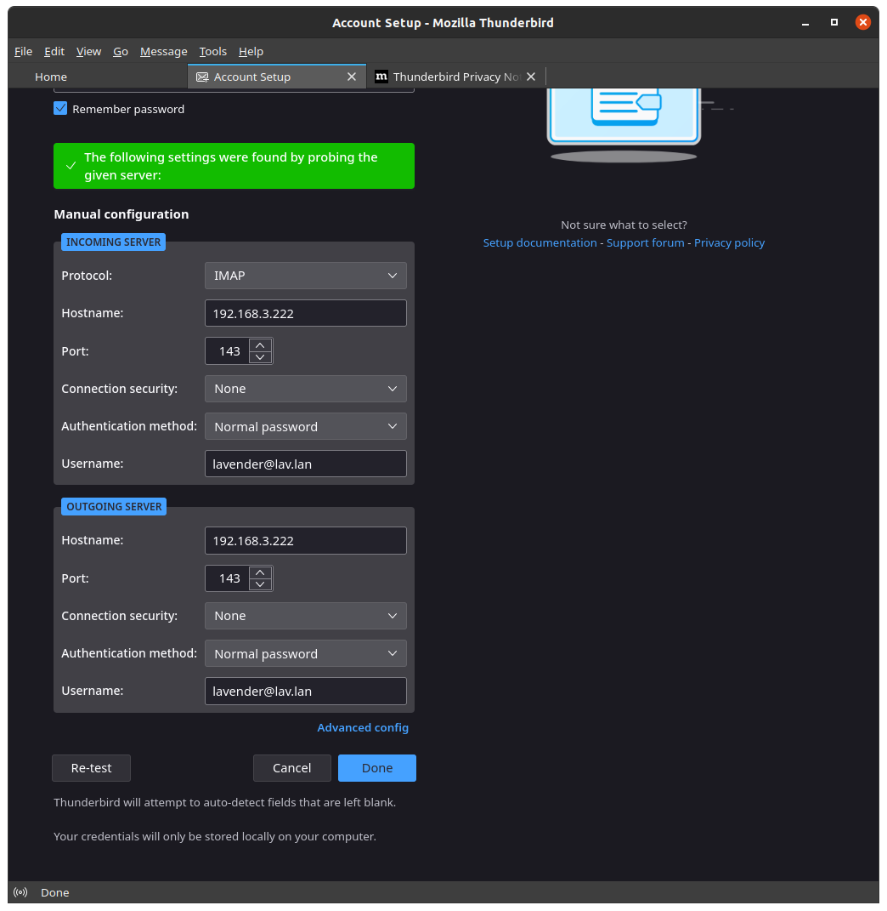

July 2023 Bits
================

July 8 - Installing Home Assistant OS in a VM
-----------------------------------------------

I think it's finally time to go back into some of my own homelab projects.
`Proxmox VE Helper Scripts <https://tteck.github.io/Proxmox/>`_ has like 4 different scripts for installing HA in some way.
Some ways use Linux Containers that just install Home Assistant in Docker. 
One way installs Home Assistant core in a Linux Container, but warns about being tightly coupled to the underlying system.
The way I'm going to go with is just installing HA in a VM.
I don't have any production VMs at the moment, so I'm excited to see how this turns out.
I'm also excited that I'm using the official disk image provided by HA.
I asked ChatGPT to give me an aquatic animal that performs repetitive tasks and it gave me an octopus.
That will not be the name of this container.

I tried getting Caddy to serve home assistant using its reverse proxy directive, but I get a 400 bad request.
Not sure what's up with that. Maybe I'll figure it out one day.

July 8 - Gitea setup
----------------------

I was looking at `comparisons <https://docs.gitea.com/next/installation/comparison>`_ today to decide if I wanted to run Gitea or GitLab,
and I think Gitea will be a good fit for me, especially because it supports the same format as GitHub Actions.
Gitea has a nice `install with docker <https://docs.gitea.com/next/installation/install-with-docker>`_ page.

I got it installed and I need to do some additional config.
I was going to try to `disable registration <https://docs.gitea.com/next/administration/config-cheat-sheet#service-service>`_
with ``GITEA__service__DISABLE_REGISTRATION=true``, but I found that only works if you have that set upon the first startup of the container.
So I made it so ``/data/gitea/conf`` is fully configurable by me and version controlled and I edited ``app.ini`` from there.

I want to mirror the solarthing repository here as a test, so I just started to create a new repo, chose "New Migration", GitHub,
added my API key, and mirrored everything there is to mirror.

I also went to my account settings and added some email addresses including retrodaredevil@users.noreply.github.com.

July 16 - Thinking about Email Server + Adguard Home Custom DNS Entries
-----------------------------------------------------------------------

I'm thinking about getting a local only email server setup so I can get notifications and stuff from my services,
or at least be able to reset my password or something.
Basically I want to set up a mail server, but I don't need it to communicate with external email servers
because I know how difficult that is to set up and get right.

Before I get a jump on finding the right software to accomplish this,
I want to at least have some sort of internal DNS entry so that ``lav.lan`` routes to my server.
Adguard Home has a "DNS rewrites" feature found under the Filters tab.
Adding it got the job done! Now onto email.

I followed https://setup.mailu.io/2.0/ and a little bit later I had a docker compose file that I have edited.
I changed all the ports to be exposed on my local network's interface.
I had to navigate to the ``/admin`` endpoint.
The root endpoint gave me a 404, which was discouraging at first until I realized I needed to navigate to ``/admin``.
Now while it's running I run ``docker compose -p mailu exec admin flask mailu admin admin lav.lan PASSWORD``
and huzzah, I have an admin user with the password: PASSWORD.

Of course I don't have encryption set up, but that's OK for my use case.
I incorrectly used port 143 for outgoing mail when I should have used port 25 to use SMPT as the outgoing connection.
However, it doesn't matter with my Wireguard setup anyway. I'm not on my home network and it seems to be mad that my traffic is coming from
my Wireguard host, which is a little weird, but whatever.

Since I want to get this fully working, I want to install a web interface. Luckily Mailu has support for Snappymail and Roundcube.
Roundcube seems to be more popular and its website is more polished, so I'll go with that.
I regenerated the compose and env file and then migrated the changes over to my current configuration.
I got an error because I was exposing the port via ``192.168.X.X:81:80`` and it didn't like that.
I added the front to my caddy network and all of a sudden I could access the web interface over my domain and it worked!
However, when trying to send an email, I get this:

.. code-block::

  SMTP Error (451): Failed to set sender "lavender@lav.lan" (4.7.1 Service unavailable - try again later).

I figured I would be able to send an email to myself, but that's too much apparently.
Apparently the antispam service was a requirement for getting this working. I can send emails now!
However, if I try to send from Thunderbird I get a different error:

.. code-block::

  Rejected (anti-spoofing: DMARC compliance is enforced for local domains, regardless of the policy setting). Please check the message and try again.

I think solving that will be for another time. I'm just glad to have the web interface working as intended.
