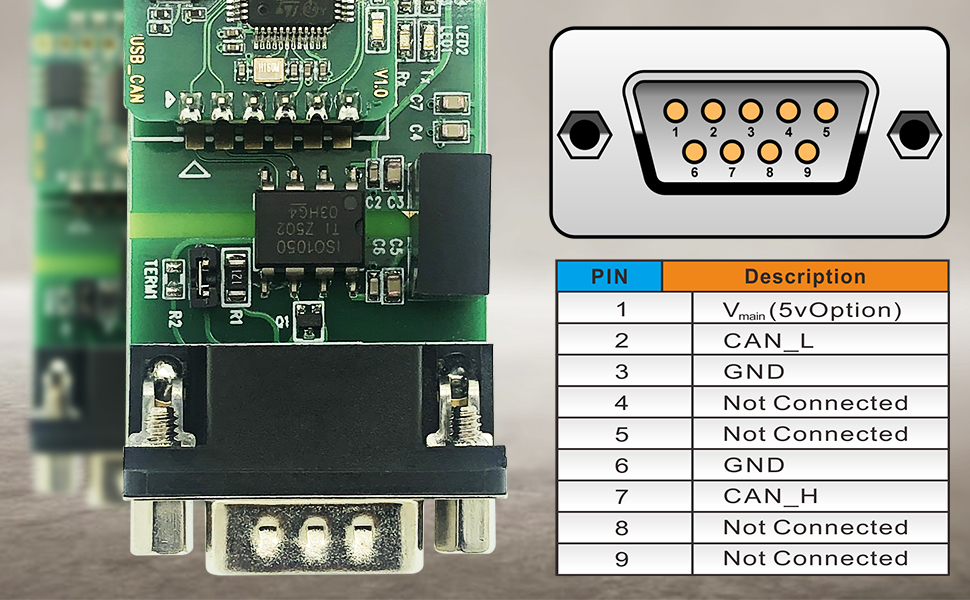

June 2023 CAN bus on a Raspberry Pi
======================================

June 24 - Installing Raspberry Pi OS
------------------------------------

Today I'm setting up our old CabinPi to be CanPi.
I actually used RPi Imager for this as some things have changed since the last time I flashed an image and configured SSH access,
so I figured I would just use RPi Imager to get the job done.
I installed the 32-bit version as I am using a Raspberry Pi 2.

As I configure it, here are a few things I am doing (documenting these might help me make a Raspberry Pi Image for SolarThing in the future).

* https://docs.docker.com/engine/install/raspbian/#install-using-the-repository
* ``sudo rm /etc/sudoers.d/010_pi-nopasswd``
* ``sudo apt install -y net-tools vim-gtk iputils-tracepath traceroute curl wget git netcat tmux tree man-db file xsel htop gpg-agent rsync pwgen``

  * Stolen from https://gist.github.com/retrodaredevil/def6d23a03d9e46683933ef0c017d96c

Configuring SocketCAN
-----------------------

The adapter I got is the `USB CAN Converter Module for Raspberry Pi <https://www.amazon.com/gp/product/B0956NV6CM>`_.
The description of the item mentions Socket-CAN, so I need to figure out what that means driver wise.
When I eventually go to connect it, this is the pin out:

I have my device plugged in so I need to figure out how to access it.
This `pragmaticlinux.com tutorial <https://www.pragmaticlinux.com/2021/10/can-communication-on-the-raspberry-pi-with-socketcan/>`_
seems to have many of the steps I need that the python-can docs don't cover.
If I run ``ip addr | grep can`` I get this:

.. code-block::

  7: can0: <NOARP,ECHO> mtu 16 qdisc noop state DOWN group default qlen 10
      link/can

Awesome! My device is recognized. Let's make sure the drivers are up:

.. code-block:: console

  lavender@canpi:~ $ lsmod | grep can
  can_raw                20480  0
  can                    28672  1 can_raw
  can_dev                40960  1 gs_usb

Now let's try to configure it and bring it to the UP state.

.. code-block:: console

  lavender@canpi:~ $ sudo ip link set can0 up type can bitrate 1000000 restart-ms 100
  lavender@canpi:~ $ ip addr | grep can
  7: can0: <NOARP,UP,LOWER_UP,ECHO> mtu 16 qdisc pfifo_fast state UP group default qlen 10
      link/can

Now let's install can-utils

.. code-block::

  sudo apt-get install -y can-utils

With tmux open, this is what I did:

.. code-block::

  lavender@canpi:~ $ candump -tz can0                          │lavender@canpi:~ $ cansend can0 456#00FFAA5501020304
   (000.000000)  can0  456   [8]  00 FF AA 55 01 02 03 04      │lavender@canpi:~ $ cansend can0 456#00FFAA5501020304
  ^Clavender@canpi:~ $ ^C                                      │lavender@canpi:~ $ 
  lavender@canpi:~ $ candump -tz can0                          │lavender@canpi:~ $ cansend can0 456#00FFAA5501020304
                                                               │lavender@canpi:~ $ cansend can0 456#00FFAA5501020304
                                                               │lavender@canpi:~ $ cansend can0 456#00FFAA5501020303
                                                               │lavender@canpi:~ $ cansend can0 456#00FFAA5501020303
                                                               │lavender@canpi:~ $

For some reason when I was doing this it only picked up the first message, and then I couldn't get it to do it again.
Not sure what's up with that.
When I rebooted I could get the messages again until I CTRL+C'd out of the ``candump`` command and went back in.
Weird. At this point I'm not convinced it's something to worry about, at least not this early.

CAN in Python
--------------

Let's try to get SocketCAN working with python-can.

For testing, these are the commands I ran:

.. code-block::

  sudo apt-get install -y python3-pip python3-venv
  python3 -m venv venv
  . venv/bin/activate
  pip install python-can

Now that I have ``python-can`` installed, I can look into getting it working.
python-can has some nice `Socketcan Quickstart#Real Device <https://python-can.readthedocs.io/en/stable/interfaces/socketcan.html#real-device>`_ documentation.
I edited ``test.py`` with this:

.. code-block:: python3

  import can

  with can.Bus(interface='socketcan', channel='can0', receive_own_messages=True) as bus:
      message = can.Message(arbitration_id=123, is_extended_id=True, data=[0x11, 0x22, 0x33])
      bus.send(message, timeout=0.2)
      count = 0
      for msg in bus:
          count += 1
          print(f"{msg.arbitration_id:X}: {msg.data}")
          if count >= 10:
              print("Breaking")
              break

I'm not sure why the ``for msg in bus:`` kept giving me the same message over and over again, but this was the output:

.. code-block::

  (venv) lavender@canpi:~/Documents $ python test.py 
  24: bytearray(b'\x000\x00\x00\x00\x00\x80\x00')
  24: bytearray(b'\x000\x00\x00\x00\x00\x80\x00')
  24: bytearray(b'\x000\x00\x00\x00\x00\x80\x00')
  24: bytearray(b'\x000\x00\x00\x00\x00\x80\x00')
  24: bytearray(b'\x000\x00\x00\x00\x00\x80\x00')
  24: bytearray(b'\x000\x00\x00\x00\x00\x80\x00')
  24: bytearray(b'\x000\x00\x00\x00\x00\x80\x00')
  24: bytearray(b'\x000\x00\x00\x00\x00\x80\x00')
  24: bytearray(b'\x000\x00\x00\x00\x00\x80\x00')
  24: bytearray(b'\x000\x00\x00\x00\x00\x80\x00')
  Breaking

Hell, even when I took out the ``bus.send`` I still got data back.
With a reboot I didn't get data back now:

.. code-block::

  (venv) lavender@canpi:~/Documents $ sudo ip link set can0 up type can bitrate 1000000 restart-ms 100                                                              
  (venv) lavender@canpi:~/Documents $ python test.py

Now I uncomment the ``bus.send`` line and get this:

.. code-block::

  (venv) lavender@canpi:~/Documents $ python test.py
  7B: bytearray(b'\x11"3')
  4: bytearray(b'\x00\x00\x00\x00\x00\x00\x08\x00')
  24: bytearray(b'\x00\x00\x00\x00\x00\x00\x10\x00')
  24: bytearray(b'\x00\x00\x00\x00\x00\x00\x18\x00')
  24: bytearray(b'\x00\x00\x00\x00\x00\x00 \x00')
  4: bytearray(b'\x00\x00\x00\x00\x00\x000\x00')
  24: bytearray(b'\x00\x00\x00\x00\x00\x008\x00')
  24: bytearray(b'\x00\x00\x00\x00\x00\x00@\x00')
  24: bytearray(b'\x00\x00\x00\x00\x00\x00H\x00')
  24: bytearray(b'\x00\x00\x00\x00\x00\x00P\x00')
  Breaking

Even when I set ``receive_own_messages=False`` I still get weird data.

July 8 - Update
-----------------

I finally stopped procrastinating wiring up the CAN USB adapter to the generator's CAN high and CAN low on July 4.
It didn't work. I didn't get any data after doing this and nothing seemed to change.
I tried a bunch of bitrates, but none worked. I don't even know what bitrate I am supposed to be using in the first place.
I will likely give up for now. Maybe I'll try a beaglebone that has built in CAN support to know that it's not the USB adapter,
or maybe I'll hook the adapter to a car's CAN bus to see if it was something on the DSE3110's side that was causing issues.

This is pretty frustrating because no one has done this before and DSE is not helpful in providing documentation on how to
communicate with this CAN network.

Picking out a Java CAN Bus Library
------------------------------------

``python-can`` is a nice gem of a library. Great documentation. Up to date.
Finding something similar for Java proves to be difficult.
Here are a few I found

* `dschanoeh/Kayak <https://github.com/dschanoeh/Kayak>`_

  * Archived in 2020.
  * A CAN bus analysis tool, with a ``Kayak-core`` module that looks promising.
  * Includes a `nice example <https://github.com/dschanoeh/Kayak-core-test/blob/master/src/main/java/com/github/kayakcoretest/EchoService.java>`_.

* `entropia/libsocket-can-java <https://github.com/entropia/libsocket-can-java>`_

  * Archived in 2020. Last commit in 2014.

* `jazdw/jnaCan <https://github.com/jazdw/jnaCan>`_

  * Archived in 2022. Last commit in 2015.
  * Uses lombok. Many things are mutable, but looks like a decent OOP approach to this.

* `How to use SocketCAN via Unix Domain Sockets in Java? <https://stackoverflow.com/questions/76471002/how-to-use-socketcan-via-unix-domain-sockets-in-java>`_

  * Unanswered StackOverflow question

* `Linux Docs for SocketCAN <https://docs.kernel.org/networking/can.html>`_

  * Unrelated to Java, but may help

* `The Java CAN API-a Java gateway to field bus communication <https://doi.org/10.1109/WFCS.2000.882531>`_

  * A paper on CAN communication using Java. Very old article. Likely not relevant anymore
